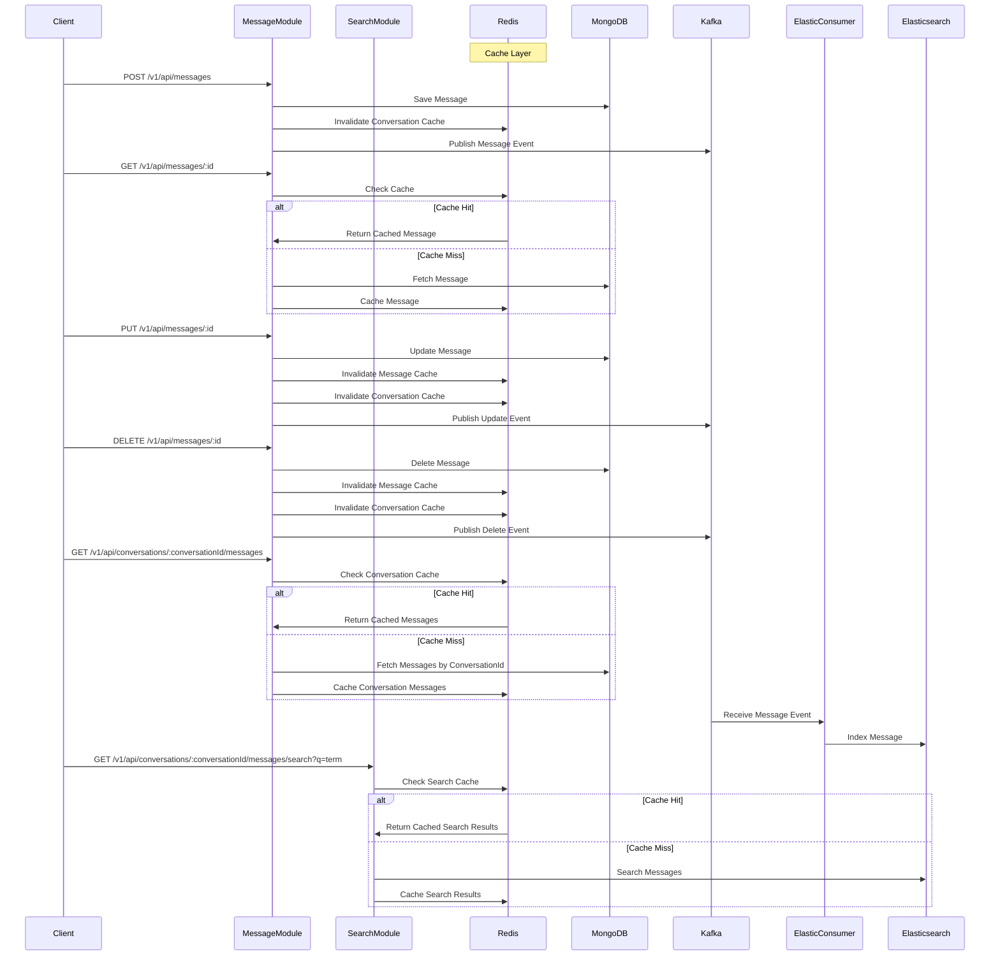

# API Documentation

## RESTful API Conventions

The API follows RESTful conventions with JSON payloads and standard HTTP methods.

### Request Headers

- `Authorization`: Bearer token for authentication
- `X-Tenant-Id`: Required for multi-tenant isolation

---

## API Endpoints Overview



---

## Endpoint Details

### Message Operations

#### Create Message

- **POST** `/v1/api/messages`
- **Required Headers:** `X-Tenant-Id`, `Authorization: Bearer token`
- **Request Body:**
  ```json
  {
    "conversationId": "string",
    "senderId": "string",
    "content": "string",
    "metadata": {
      "key1": "value1",
      "key2": "value2"
    }
  }
  ```
- **Response:** 201 Created
- **Caching Behavior:** Invalidates conversation cache entries to ensure consistency.

#### Get Message by ID

- **GET** `/v1/api/messages/:id`
- **Required Headers:** `X-Tenant-Id`, `Authorization: Bearer token`
- **Response:** 200 OK
- **Caching Behavior:** Cached for 1 hour (TTL: 3600 seconds) with key pattern `message:{tenantId}:{id}`.

#### Update Message

- **PUT** `/v1/api/messages/:id`
- **Required Headers:** `X-Tenant-Id`, `Authorization: Bearer token`
- **Request Body:**
  ```json
  {
    "content": "string",
    "metadata": {
      "key1": "value1"
    }
  }
  ```
- **Response:** 200 OK
- **Caching Behavior:** Invalidates message cache and related conversation cache entries, then updates cache with new data.

#### Delete Message

- **DELETE** `/v1/api/messages/:id`
- **Required Headers:** `X-Tenant-Id`, `Authorization: Bearer token`
- **Response:** 204 No Content
- **Caching Behavior:** Invalidates message cache and related conversation cache entries.

### Conversation Operations

#### Get Messages for a Conversation

- **GET** `/v1/api/conversations/:conversationId/messages`
- **Required Headers:** `X-Tenant-Id`, `Authorization: Bearer token`
- **Query Parameters:**
  - `page` (default: 1)
  - `limit` (default: 10)
  - `sortField` (e.g., timestamp)
  - `sortDirection` (asc/desc)
- **Response:** 200 OK
- **Caching Behavior:** Cached for 5 minutes (TTL: 300 seconds) with key pattern `conversation-messages:{tenantId}:{conversationId}:{page}:{limit}:{sortField}:{sortDirection}`.

### Search Operations

#### Search Messages in a Conversation

- **GET** `/v1/api/conversations/:conversationId/messages/search`
- **Required Headers:** `X-Tenant-Id`, `Authorization: Bearer token`
- **Query Parameters:**
  - `q` (required, search term)
  - `page` (default: 1)
  - `limit` (default: 10)
- **Response:** 200 OK
- **Caching Behavior:** Search results cached for 5 minutes (TTL: 300 seconds) with key pattern `search:messages:{tenantId}:{conversationId}:{searchTerm}:{page}:{limit}`.

## Error Handling

The system implements a consistent error handling strategy through a `GlobalExceptionFilter`:

### Error Response Format

```json
{
  "status": 400,
  "message": "Error message or validation errors",
  "error": "Error type",
  "timestamp": "2023-08-15T12:34:56Z",
  "path": "/api/messages",
  "correlationId": "optional-correlation-id"
}
```

### Error Categories

- **Validation Errors (400)**: Input validation failures with detailed field errors
- **Authentication Errors (401)**: Missing or invalid authentication token
- **Authorization Errors (403)**: Insufficient permissions for the requested operation
- **Not Found Errors (404)**: Requested resource doesn't exist
- **Conflict Errors (409)**: Resource conflict, e.g., duplicate message ID
- **Internal Errors (500)**: Unexpected server errors

### Error Logging

- HTTP 4xx errors are logged at WARNING level
- HTTP 5xx errors are logged at ERROR level with stack traces
- Correlation IDs are included in logs for request tracing
- Sensitive data is redacted from error logs
