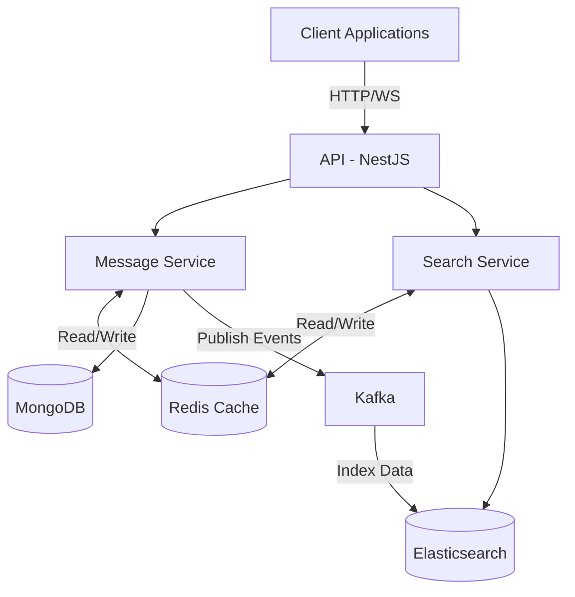

# Architecture Overview

## System Architecture

This system follows a Domain-Driven Design (DDD) approach implemented as a modular monolith. The architecture separates concerns into well-defined modules while maintaining the deployment simplicity of a monolithic application.

The architecture introduces Redis as a distributed caching layer that sits between the service layer and the databases. This provides significant performance improvements by reducing database load and serving frequently accessed data directly from memory.
