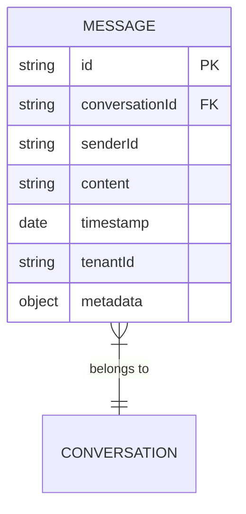

## MongoDB Schema Design



---

## Message Collection Indexes

```javascript
// Primary key
{ id: 1 }

// Multi-tenant queries
{ tenantId: 1, id: 1 }

// Conversation retrieval
{ tenantId: 1, conversationId: 1 }

// Sorted conversation messages
{ conversationId: 1, timestamp: -1 }

// Text search (fallback)
{ content: "text" }
```

---

## Elasticsearch Mappings

```json
{
  "mappings": {
    "properties": {
      "id": { "type": "keyword" },
      "conversationId": { "type": "keyword" },
      "senderId": { "type": "keyword" },
      "content": {
        "type": "text",
        "analyzer": "standard",
        "fields": {
          "keyword": { "type": "keyword" },
          "ngram": {
            "type": "text",
            "analyzer": "ngram_analyzer"
          }
        }
      },
      "timestamp": { "type": "date" },
      "tenantId": { "type": "keyword" },
      "metadata": { "type": "object", "enabled": true }
    }
  },
  "settings": {
    "analysis": {
      "analyzer": {
        "ngram_analyzer": {
          "type": "custom",
          "tokenizer": "standard",
          "filter": ["lowercase", "ngram_filter"]
        }
      },
      "filter": {
        "ngram_filter": {
          "type": "ngram",
          "min_gram": 2,
          "max_gram": 15
        }
      }
    },
    "index": {
      "max_ngram_diff": 15
    }
  }
}
```

---

## Indexing Strategy

- **Primary Write to MongoDB**: All write operations target MongoDB first.
- **Event-Based Indexing**: Changes are propagated to Elasticsearch via Kafka events.
- **Tenant Isolation**: All queries include tenant filters in both MongoDB and Elasticsearch.
- **Optimized Text Search**: Ngram analyzer for partial word matching.
