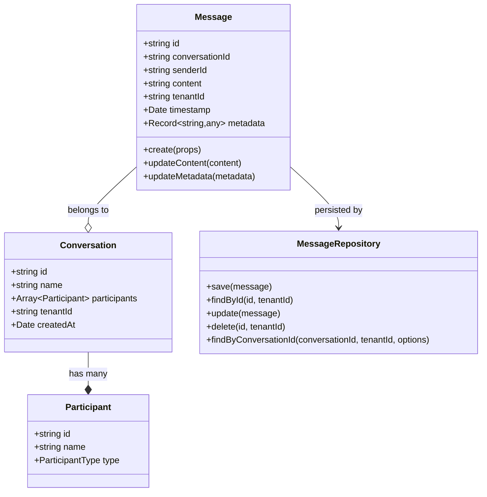

# Domain Model

## Core Domain Concepts

```mermaid
classDiagram
    class Message {
        +string id
        +string conversationId
        +string senderId
        +string content
        +string tenantId
        +Date timestamp
        +Record~string,any~ metadata
        +create(props)
        +updateContent(content)
        +updateMetadata(metadata)
    }

    class Conversation {
        +string id
        +string name
        +Array~Participant~ participants
        +string tenantId
        +Date createdAt
    }

    class Participant {
        +string id
        +string name
        +ParticipantType type
    }

    class MessageRepository {
        +save(message)
        +findById(id, tenantId)
        +update(message)
        +delete(id, tenantId)
        +findByConversationId(conversationId, tenantId, options)
    }

    Message --o Conversation : belongs to
    Conversation --* Participant : has many
    Message --> MessageRepository : persisted by
```
