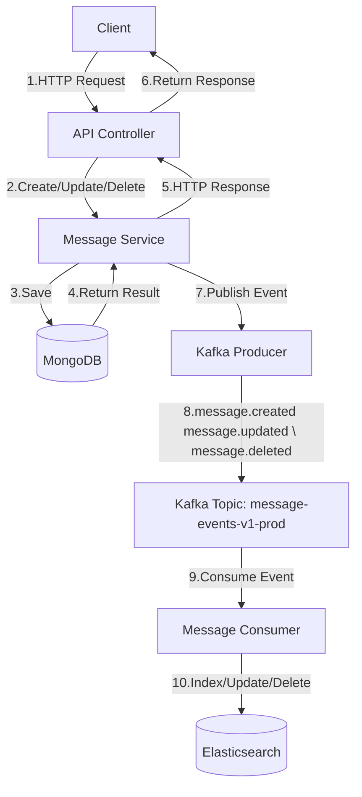

# Event Flow

## Event-Driven Architecture

The system uses an event-driven architecture to maintain data consistency between the primary database (MongoDB) and the search index (Elasticsearch).



---

## Event Types

### `message.created`

Triggered when a new message is created.

```json
{
  "type": "message.created",
  "payload": {
    "id": "123e4567-e89b-12d3-a456-426614174000",
    "conversationId": "123e4567-e89b-12d3-a456-426614174001",
    "senderId": "123e4567-e89b-12d3-a456-426614174002",
    "content": "Hello, world!",
    "tenantId": "tenant-123",
    "timestamp": "2023-08-15T10:30:00Z",
    "metadata": { "key1": "value1" }
  }
}
```

---

### `message.updated`

Triggered when an existing message is updated.

```json
{
  "type": "message.updated",
  "payload": {
    "id": "123e4567-e89b-12d3-a456-426614174000",
    "content": "Updated content",
    "tenantId": "tenant-123",
    "metadata": {
      "key1": "value1",
      "edited": true
    }
  }
}
```

---

### `message.deleted`

Triggered when a message is deleted.

```json
{
  "type": "message.deleted",
  "payload": {
    "id": "123e4567-e89b-12d3-a456-426614174000",
    "tenantId": "tenant-123"
  }
}
```

---

## Kafka Configuration

- **Topic**: `message-events-v1-prod`
- **Partitioning**: By `conversationId` (to guarantee ordering of messages within the same conversation)
- **Consumer Group**: `message-elasticsearch-indexer`
- **Retention**: 7 days
- **Headers**:
  - `correlation-id` for distributed tracing
  - `message-id` for deduplication if needed
  - `timestamp` for event timing

---

## Error Handling

- Failed message processing is **logged and retried** automatically.
- **Dead Letter Queue (DLQ)** is used for unprocessable messages.
- **Circuit Breaker** is implemented for handling Elasticsearch indexing failures.
