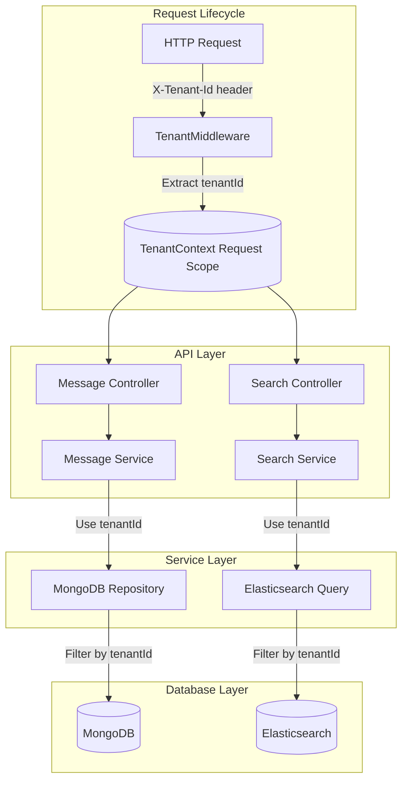

## Multi-tenant Implementation

The system implements a multi-tenant architecture where data from different tenants is logically isolated within the same infrastructure.

### Multi-tenancy Approach



---

### Tenant Context Implementation

The `TenantContext` service ensures that the tenant ID is available throughout the request lifecycle. The tenant ID is extracted from the request headers and stored in the context, making it accessible to various services during the execution of the request.

```typescript
/**
 * Service responsible for managing tenant context within a request scope
 *
 * This service maintains the current tenant ID for the duration of a request
 * and provides methods to set and retrieve the tenant context.
 *
 * @remarks
 * This service uses REQUEST scope to ensure each HTTP request gets its own
 * instance, preventing tenant context leakage between concurrent requests
 */
@Injectable({ scope: Scope.REQUEST })
export class TenantContext {
  private readonly logger = new Logger(TenantContext.name);
  private tenantId: string | undefined;

  /**
   * Sets the current tenant ID for this request context
   *
   * @param tenantId - The ID of the tenant to set as current
   */
  setCurrentTenant(tenantId: string): void {
    this.logger.debug(`Setting current tenant ID to: ${tenantId}`);
    this.tenantId = tenantId;
    this.logger.log(`Current tenant context set to: ${tenantId}`);
  }

  /**
   * Retrieves the current tenant ID from the context
   *
   * @returns The current tenant ID
   * @throws Error if tenant ID has not been set in this context
   */
  getCurrentTenant(): string {
    if (!this.tenantId) {
      this.logger.error('Attempted to access tenant ID before it was set');
      throw new Error('Tenant ID not set in context');
    }
    this.logger.debug(`Retrieved current tenant ID: ${this.tenantId}`);
    return this.tenantId;
  }

  /**
   * Checks if a tenant ID is set in the current context
   *
   * @returns Boolean indicating whether a tenant ID is set
   */
  hasTenant(): boolean {
    const hasTenant = !!this.tenantId;
    this.logger.debug(
      `Tenant context check: ${hasTenant ? 'Tenant is set' : 'No tenant set'}`,
    );
    return hasTenant;
  }

  /**
   * Clears the current tenant ID from the context
   */
  clearTenant(): void {
    if (this.tenantId) {
      this.logger.debug(`Clearing tenant ID: ${this.tenantId}`);
      this.tenantId = undefined;
      this.logger.log('Tenant context cleared');
    }
  }
}
```

---

### Data Isolation

- **MongoDB**: Every query includes a `tenantId` filter, ensuring data is isolated at the database level.
- **Elasticsearch**: Search queries include a tenant filter in the `bool` query to ensure that only data relevant to the specific tenant is returned.

- **Kafka Events**: All events published to Kafka include tenant information, which is then consumed by other services (like Elasticsearch) to ensure tenant-specific indexing and data processing.

---

### Security Considerations

- **Tenant ID in API Requests**: The `tenantId` is a required header (`X-Tenant-Id`) in all incoming API requests. If it's missing, the system will reject the request.

- **Validation of Tenant ID**: The `tenantId` is validated at the middleware level to prevent unauthorized access to data.

- **Request-scoped Tenant Context**: The tenant context is request-scoped, meaning the tenant ID is associated with the current request, preventing cross-tenant data leakage.

- **Repository Layer Filtering**: The repository layer automatically applies tenant filtering based on the current tenant's context when querying MongoDB or Elasticsearch.
