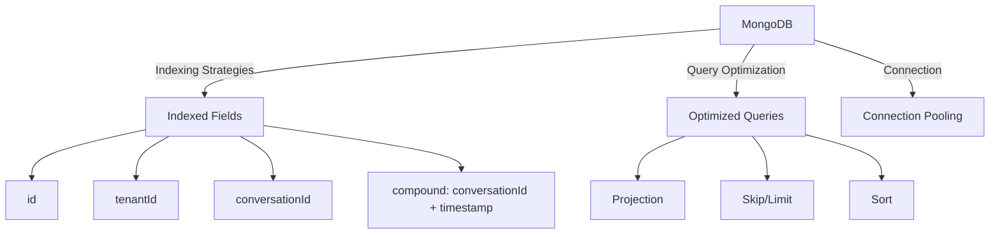
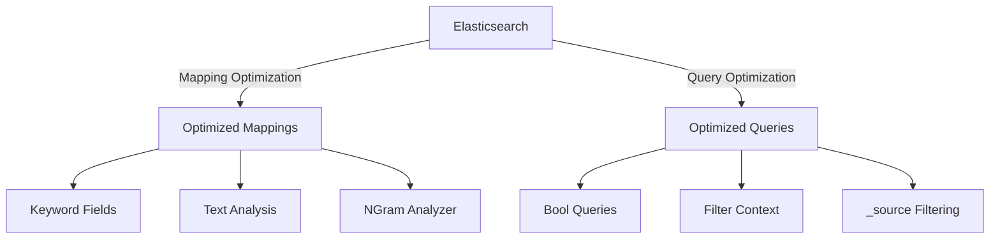
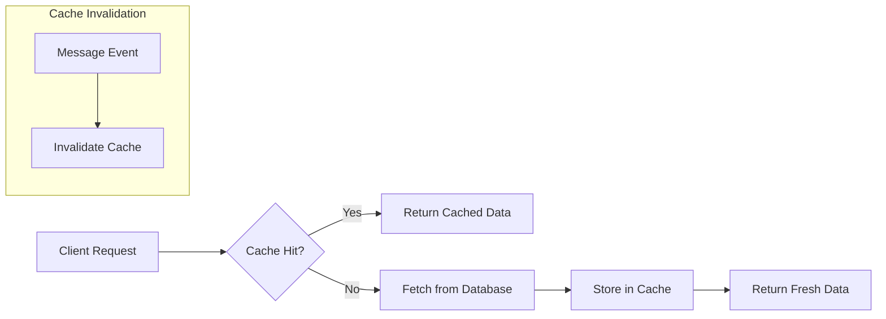

# Performance Optimizations

## Database Optimizations

- **Indexing Strategies**:
  - Primary key (`id`).
  - Tenant-aware indexing (`tenantId` + `id`).
  - Conversation retrieval (`tenantId` + `conversationId`).
  - Efficient sorting (`conversationId` + `timestamp`).
- **Query Optimization**:
  - **Projection**: Fetch only required fields.
  - **Skip/Limit**: For efficient pagination.
  - **Sort**: Use indexed fields for sorting operations.
- **Connection Pooling**:
  - Proper management of DB connections to reduce latency and resource usage.

---

## Elasticsearch Optimizations

- **Mapping Optimization**:
  - Use `keyword` fields for exact matches.
  - Apply `ngram` analyzers for partial search.
  - Tune analyzers for domain-specific needs.
- **Query Optimization**:
  - **Bool Queries**: Combine filters efficiently.
  - **Filter Context**: Use filters (non-scoring) wherever possible for better speed.
  - **\_source Filtering**: Retrieve only necessary fields to reduce payload size.

---

## Caching Strategy

The system implements a sophisticated Redis-based caching strategy:

### Message Caching

- **Individual Message Caching**: Messages are cached by ID with tenant isolation
  - Cache key format: `message:{tenantId}:{messageId}`
  - TTL: 3600 seconds (1 hour)
- **Conversation Messages Caching**: Lists of messages are cached by conversation
  - Cache key format: `conversation-messages:{tenantId}:{conversationId}:{page}:{limit}:{sortField}:{sortDirection}`
  - TTL: 300 seconds (5 minutes)

### Search Caching

- **Search Results Caching**: Search results are cached with query parameters
  - Cache key format: `search:messages:{tenantId}:{conversationId}:{normalizedSearchTerm}:{page}:{limit}`
  - TTL: 300 seconds (5 minutes)
  - Search terms are normalized (trimmed, lowercased, and extra spaces removed)

### Cache Invalidation

- **Write-Through Invalidation**: When messages are created, updated, or deleted, related cache entries are invalidated
- **Targeted Invalidation**: Only affected conversation caches are invalidated, not the entire cache
- **Graceful Degradation**: Cache failures don't block operations but are logged for monitoring

---

## Performance Metrics

### Moderate Load Test (100 req/sec)

Load testing our NestJS Messaging API with Redis caching produced the following metrics (100 requests/sec for 60 seconds):

| Metric                   | Value              |
| ------------------------ | ------------------ |
| Average response time    | 3ms                |
| Median response time     | 3ms                |
| 95th percentile          | 6ms                |
| 99th percentile          | 19.9ms             |
| Maximum response time    | 108ms              |
| Request rate             | 95 requests/second |
| Total requests completed | 6000               |
| Success rate             | 100%               |

### High Load Test (500 req/sec)

When increasing the load to 500 requests/second for 60 seconds:

| Metric                   | Value               |
| ------------------------ | ------------------- |
| Average response time    | 164.4ms             |
| Median response time     | 22ms                |
| 95th percentile          | 804.5ms             |
| 99th percentile          | 889.1ms             |
| Maximum response time    | 1011ms              |
| Request rate             | 500 requests/second |
| Total requests completed | 30000               |
| Success rate             | 100%                |

The distribution of requests in the high load test:

- GET requests (search): 14,893 requests (HTTP 200)
- POST requests (create message): 15,107 requests (HTTP 201)

These metrics demonstrate the scalability of our implementation with Redis caching. While response times increase under heavy load, the system maintains 100% reliability with no failed requests even at 500 requests per second. The significant difference between median (22ms) and mean (164.4ms) response times indicates some requests experience higher latency, likely due to cache misses or database contention, while the majority of requests are still served quickly.
