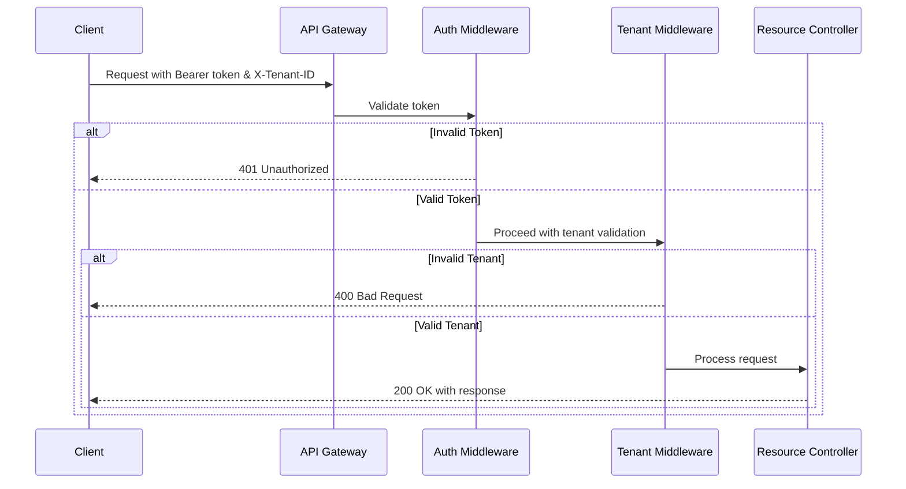
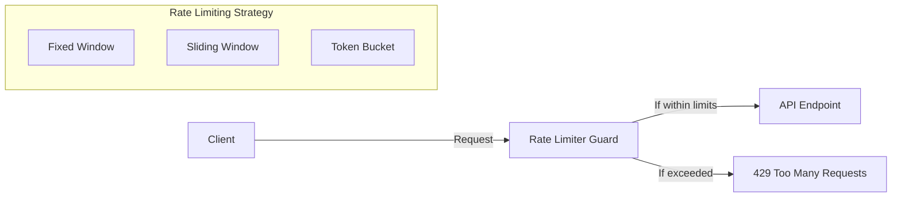

# Security Considerations

## Authentication and Authorization

- **Bearer Token Validation**: Ensures that the client is authenticated.
- **Tenant ID Validation**: Confirms that the request is associated with a valid tenant.
- **Error Responses**: 401 for authentication failures, 400 for tenant validation failures.

---

## Input Validation

- **DTO Validation**: All incoming request payloads are validated using `class-validator` decorators.
- **Whitelist Validation**: Only explicitly defined properties are allowed, preventing unexpected property injection.
- **Content Sanitization**: Text fields are sanitized to avoid XSS and injection attacks.

---

## Rate Limiting

- **ThrottlerGuard** implementation with configurable rate limits.
- **Defaults**:
  - 10 requests per minute per IP address.
- **Custom Policies**:
  - Tighter limits for sensitive operations (e.g., message creation or update).

---

## Data Protection

- **Tenant Isolation**: Enforced at the repository and search layers.
- **Input Validation and Sanitization**: Reduces attack vectors for injection and data corruption.
- **Proper Error Handling**: Prevents information leakage about the system internals.
- **Content Filtering**: Additional validation of user-submitted content (e.g., HTML tags stripping if needed).

---

## Secrets Management

- **Environment Variables**: All sensitive data (tokens, DB credentials, API keys) are loaded via environment variables.
- **No Hardcoded Secrets**: No secrets stored directly in the codebase.
- **Docker Secrets**: For production deployments, sensitive configuration is injected securely through Docker Secrets.

